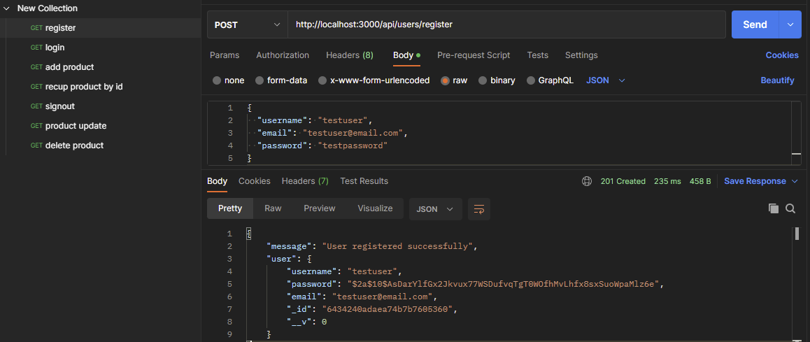

# Online Store API by Abeille Paul-Antoine
Ce projet est une API pour un magasin en ligne, construite avec Node.js, Express et MongoDB. L'API permet la gestion des utilisateurs et des produits.

## Fonctionnalités de l'API
### Utilisateurs
* Inscription : POST /api/users/register
* Connexion : POST /api/users/login
* Déconnexion : POST /api/users/signout
* Suppression d'un utilisateur : DELETE /api/users/:id
* Mise à jour d'un utilisateur : PUT /api/users/:id
* Récupération d'un utilisateur par ID : GET /api/users/:id
* Recherche d'utilisateurs : GET /api/users/search/ecrire ici
### Produits
* Récupération de tous les produits : GET /api/products
* Création d'un produit : POST /api/products
* Mise à jour d'un produit : PUT /api/products/:id
* Suppression d'un produit : DELETE /api/products/:id
* Recherche de produits : GET /api/products/search/ecrire ici
## Structure du projet
* index.js : point d'entrée de l'application, configuration d'Express et de MongoDB, déclaration des routes pour les utilisateurs et les produits, et écoute sur un port spécifique.
* /routes/users.js : définition des routes pour les utilisateurs, en associant chaque route à une fonction de contrôleur dans userController.js.
* /routes/products.js : définition des routes pour les produits, en associant chaque route à une fonction de contrôleur dans productController.js.
* /controllers/userController.js : contrôleur des utilisateurs, avec les fonctions pour gérer les différentes actions des utilisateurs.
* /controllers/productController.js : contrôleur des produits, avec les fonctions pour gérer les différentes actions des produits.
## Comment démarrer le projet
1. Assurez-vous d'avoir installé Node.js et MongoDB sur votre machine.
1. Ouvrez un terminal et accédez au répertoire du projet.
1. Exécutez npm install pour installer les dépendances du projet.
1. Démarrez MongoDB, si ce n'est pas déjà fait.
1. Exécutez node index.js pour lancer l'application.
1. L'API sera disponible à l'adresse http://localhost:3000

## Voici quelques exemples en image avec Postman
Pour les POST :   \
Pour les GET :  \
Pour les PUT :  \
Pour les DELETE :  

Voici du json pour tester :\
register : \
{
  "username": "testuser",
  "email": "testuser@email.com",
  "password": "testpassword"
}

login  : \
{
  "email": "testuser@email.com",
  "password": "testpassword"
}

add product : \
{
  "name": "NIKE",
  "description": "This is a new product",
  "price": 29.99,
  "stock": 10
}

update product : \
{
  "name": "Updated Product",
  "description": "This is an updated example product.",
  "price": 19.99,
  "stock": 200
}

Pour rechercher un article qui contient NIKE, on fait un get avec ça : \
http://localhost:3000/api/products/search/NIKE

Je vous laisse libre de faire les tests que vous souhaitez .